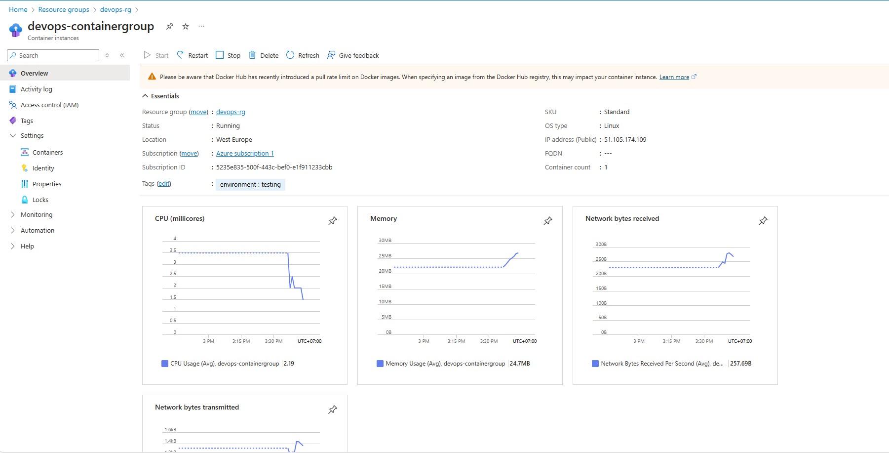
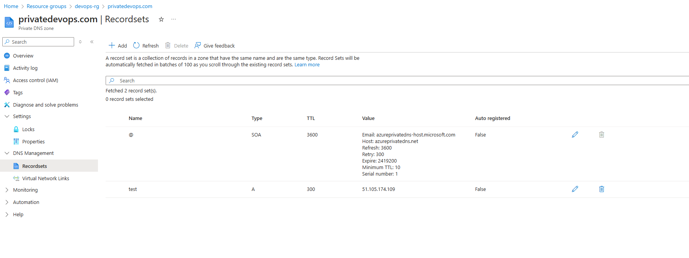
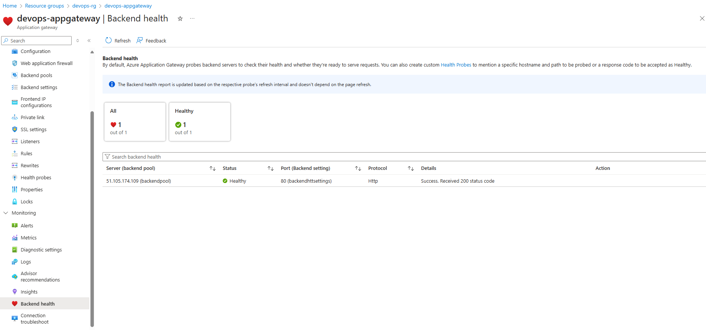
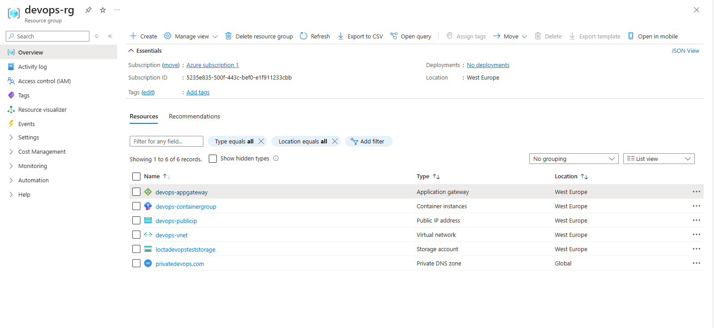

# Azure Docker App

This repository contains Terraform configurations to deploy an Azure infrastructure with the following components:
- Azure Container App
- Azure Private DNS Zone
- Azure Application Gateway

## Prerequisites

- [Terraform](https://www.terraform.io/downloads.html) installed
- Azure subscription
- Azure CLI installed and authenticated

## Repository Structure

```
├── modules
│   ├── container_app
│   |     ├── container_app.tf
|   |     ├── variables.tf
│   ├── application_gateway
│   |     ├── application_gateway.tf
|   |     ├── variables.tf
│   ├── private_dns_zone
│   |     ├── private_dns_zone.tf
|   |     ├── variables.tf
├── main.tf
├── variables.tf
└── README.md
```


## Components

### Azure Container App

The Azure Container App is defined in the [container_app.tf](modules/container_app/container_app.tf) file. It deploys a container group with a single container running an Nginx image.



### Azure Private DNS Zone

The Azure Private DNS Zone is defined in the [private_dns_zone.tf](modules/private_dns_zone/private_dns_zone.tf) file. It creates a private DNS zone and an A record pointing to the container group's IP address.



### Azure Application Gateway

The Azure Application Gateway is defined in the [application_gateway.tf](modules/application_gateway/application_gateway.tf) file. It sets up an application gateway with a frontend IP configuration, backend pool, and routing rules.



### Azure Resource Group

The Azure Resource Group is created to hold all the resources. It is defined in the [main.tf](main.tf) file.



## Usage

1. Clone the repository:
    ```sh
    git clone https://github.com/yourusername/azuredockerapp.git
    cd azuredockerapp
    ```
2. Apply the storage configuration first to create the storage account and container:

    ```sh
    cd storage
    terraform init
    terraform apply
    ```

3. Initialize the backend and apply the rest of the configuration:
    ```sh
    cd ..
    terraform init
    ```

3. Review the Terraform plan:
    ```sh
    terraform plan
    ```

4. Apply the Terraform configuration:
    ```sh
    terraform apply
    ```

5. Confirm the apply step by typing `yes` when prompted.

## Variables

The following variables can be configured in the [variables.tf](http://_vscodecontentref_/13) file:

- `location`: The location of the resources (default: `West Europe`)
- `resource_group_name`: The name of the resource group (default: `devops-rg`)
- `subscription_id`: The subscription ID for the Azure account

## Outputs

- `container_group_ip`: The IP address of the container group

## Cleanup

To destroy the resources created by this Terraform configuration, run:
```sh
terraform destroy